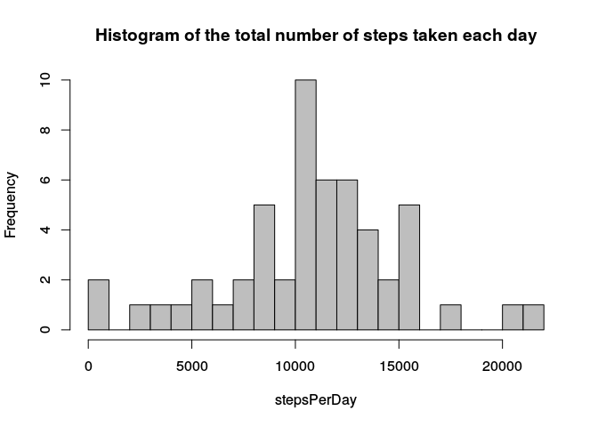
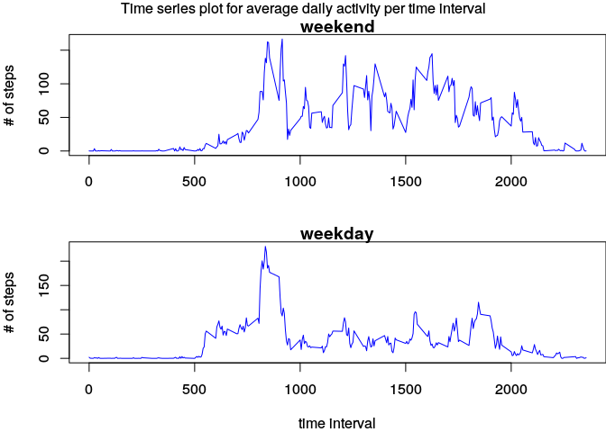

# Reproducible Research: Peer Assessment 1


## Loading and preprocessing the data

First of all, we internally unzip the archive and then read it into `data` variable taking into account the data-types for each column. After that, let's remove all rows with `NA`.

```r
data.raw <- read.table(unz("activity.zip", "activity.csv"), header=TRUE, sep=",", colClasses=c("numeric", "Date", "numeric"))
completeIndexes <- complete.cases(data.raw)
data <- data.raw[completeIndexes,]
```

## What is mean total number of steps taken per day?

First od all, let's compute the total number of steps for each date. It is easy to do with `tapply` function.

```r
stepsPerDay <- tapply(data$steps, data$date, sum)
```

To plot a histogram, let's use 25 bins for pretty look of the bars.

```r
hist(stepsPerDay, 25, col = "gray", main = "Histogram of the total number of steps taken each day")
```

 

The mean total number of steps taken per day is `{r}mean(stepsPerDay)`.

The median total number of steps taken per day is `{r}median(stepsPerDay)`.


## What is the average daily activity pattern?

To determine the average daily activity pattern we use the third column of the data as factor:

```r
dailyPattern <- tapply(data$steps, data$interval, mean)
plot(data$interval[1:length(dailyPattern)], dailyPattern, type="l", xlab="time interval", ylab="average daily activity per time interval", main="Time series plot for average daily activity per time interval")
```

 

The peak activity time interval contining the the maximum number of steps for daily average is '{r}names(which.max(dailyPattern))`.

## Imputing missing values

The total number of missing values can be computed using `complete.cases` function (as it was done above). Therefore, the number of incomplete observations is `{r}length(completeIndexes) - sum(completeIndexes)`.

Let's fill the missing data with an avarage daily activity for that interval.

```r
data.new <- data.frame(data.raw)
for (i in 1:nrow(data.new)) {
  if (is.na(data.new[i,1])) {
    data.new[i,1] <- dailyPattern[as.character(data.new[i,3])]
  }
}
```

Look at the histogram:

```r
stepsPerDay.new <- tapply(data.new$steps, data.new$date, sum)
hist(stepsPerDay.new, 25, col = "gray", main = "Histogram of the total number of steps taken each day for the new dataset")
```

 

The mean total number of steps taken per day for the new dataset is `{r}mean(stepsPerDay.new)`.

The median total number of steps taken per day for the new dataset is `{r}median(stepsPerDay.new)`.

Obviously, the statistical summary is different different for the new dataset with filled in missing data comapre to the original dataset with removed observations containing missing values. However, this particular strategy of filling in the missing data with the daily averages did not affect the avaerage number of steps for the whole day. If the strategy of filling in the missing data is different, then the effect might be more noticable. For example, filling in the missing data with 0 value brings the expected (average) number of steps per day down:

```r
data1 <- data.frame(data.raw)
for (i in 1:nrow(data1)) {
  if (is.na(data1[i,1])) {
    data1[i,1] <- 0
  }
}
stepsPerDay1 <- tapply(data1$steps, data1$date, sum)
summary(stepsPerDay1)
```

```
##    Min. 1st Qu.  Median    Mean 3rd Qu.    Max. 
##       0    6778   10400    9354   12810   21190
```


## Are there differences in activity patterns between weekdays and weekends?

First of all, let's determine, if a date falls on weekday or not and add this as a fourth column to the data:

```r
data.new <- cbind(data.new, ifelse(!(weekdays(data.new$date) %in% c("Saturday", "Sunday", "samedi", "dimanche")), "weekday", "weekend"))
names(data.new)[4] <- "day"
weekdays <- data.new$day == "weekday"
dailyPattern.weekday <- tapply(data.new[weekdays,]$steps, data.new[weekdays,]$interval, mean)
dailyPattern.weekend <- tapply(data.new[!weekdays,]$steps, data.new[!weekdays,]$interval, mean)
```


```r
par(mfrow = c(2,1), mar = c(4,4,1,0), oma = c(0,0,1,0))
plot(data$interval[1:length(dailyPattern)], dailyPattern.weekend, type = "l", xlab = NA, ylab = "# of steps", main = "weekend", col = "blue")
plot(data$interval[1:length(dailyPattern)], dailyPattern.weekday, type = "l", xlab = "time interval", ylab = "# of steps", main = "weekday", col = "blue")
mtext("Time series plot for average daily activity per time interval", outer = TRUE)
```

 

Clearly, thre is a difference between weekdays and weekends pattern activity.

